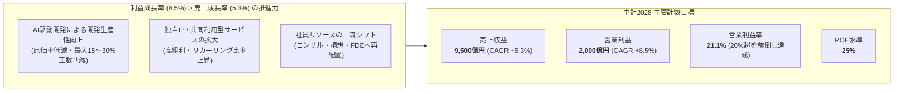
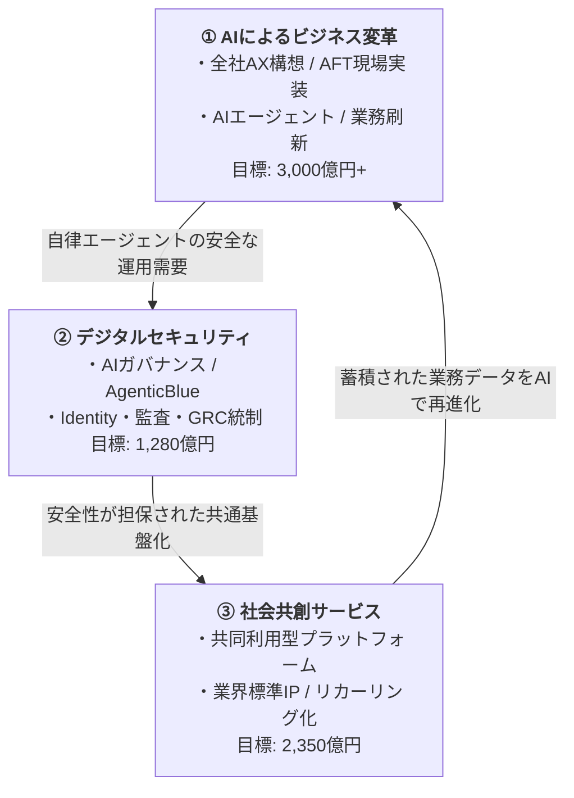
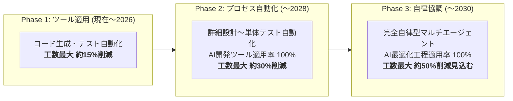

# NRI 中期経営計画 2026-2028 分析

基準日: 2026-09-25

## Executive take

NRIの中計2028は、表面的には売上CAGR約5%の比較的穏当な計画だが、中身はかなり大きな構造転換を含んでいる。

中心は次の4点。

1. **DXからAXへ** — AIを個別業務効率化ではなく、企業全体の業務・組織・システムを再設計する需要として捉える。
2. **NRI自身もAIで生産構造を変える** — 開発工程をAI駆動化し、人材を上流へ移し、工数販売から価値・成果ベースへ寄せる。
3. **海外の規模拡大を修正** — 北米・豪州は売上規模追求より、事業再構築と安定収益化を優先する。
4. **高ROEと成長投資を同時に狙う** — 3年間で約2,400億円を投資しつつ、ROE25%水準、配当性向40%、機動的な自社株買いを掲げる。

---

## 1. 中計の骨格

### Fact

2026年4月24日公表の中期経営計画（2026-2028）は、2028年度に以下を目標とする。

- 売上収益: **9,500億円**
- 営業利益: **2,000億円**
- 営業利益率: **21.1%**
- 2025年度→2028年度 売上CAGR: **+5.3%**
- 同 営業利益CAGR: **+8.5%**
- ROE: **25%水準**

また、V2030で掲げていた「営業利益率20%以上」は2026年度に前倒し達成する計画としている。

### Interpretation

売上成長より利益成長を高く置いており、**量の拡大より収益構造の改善を重視**している。特にAI駆動開発と自社IP/共同利用型サービスによって、売上成長以上に利益を伸ばす設計になっている。

一方、経営陣は説明会で営業利益2,000億円を「かなり固め」「ミニマムのコミットメント」と表現している。つまり公表数字には一定の保守性を持たせ、AI生産革新の効果が上振れした場合は上方修正余地を残している。

---

## 2. 3つの成長領域

中計では成長領域を以下の3つに再整理した。

### ① AIによるビジネス変革

最重要テーマ。

- 顧客のAX構想を戦略コンサル起点で包括支援
- NRIプラットフォームへのAI組み込み
- メガクラウド・AIスタートアップ・Anthropic等との共創
- AXイノベーションセンターを核に全社横断で推進
- AIエージェント、AI HUB等の変革ツール開発
- 既存システムのAIネイティブ化
- AI駆動開発モデル構築

数値目標は、AI関連売上を約300億円から**2028年度3,000億円以上**へ。中計資料では「2028年には新規プロジェクトを全てAI関連に」「2030年にはすべての売上をAI関連に」としている。

AI関連投資は3年間で**800億円**。2025年度比で年平均投資額を約1.5倍にする。

### ② デジタルセキュリティ

- GRCコンサル高度化
- AI活用とビッグテック連携
- デジタルトラスト基盤
- グローバルSOC
- 国内2,000名体制

売上目標は2025年度962億円 → 2028年度1,280億円。

AIの普及をセキュリティ事業の脅威ではなく、**新しい需要源**として取り込む設計になっている点が重要。

### ③ 社会共創サービス

NRI独自IP、金融ビジネスプラットフォーム、ソーシャルDX、デジタル社会資本を拡張する。

売上目標は2025年度1,933億円 → 2028年度2,350億円。

### Interpretation

3領域は独立しているようで、実際には相互補完関係にある。

**AIで業務を変える → セキュリティとガバナンスが必要になる → 標準化された部分をプラットフォーム/共同利用型サービスにする**、という循環を作ろうとしていると読める。

---

## 3. NRI自身の「生産革新」

中計で最も重要だが、対外AIサービスより見落としやすい部分。

### Fact

NRIはAI駆動開発を段階的に展開している。

- コード生成・テスト支援
- NRI固有の大規模開発知見をAIへ形式知化
- エージェント型開発
- 将来的には完全自律型AIエージェント活用
- 2028年度 AI開発ツール適用率100%
- 2030年度 AI最適化工程適用率100%

2026年5月の機関投資家向け説明では、

- テスト/コーディングへのAI適用でプロジェクト全体の最大約15%工数削減
- 詳細設計～単体テスト自動化で最大約30%削減
- 研究段階の次ステップでは最大約50%削減を見込む

と説明している。

### 人員への意味

経営陣は、削減した工数を単純な人員削減に使うのではなく、社員を上流工程へシフトし、売上拡大に使う方針を示している。

同時に、パートナー依存度は低下すると想定。優秀なパートナーへ絞り込み、高付加価値業務への移行を促すと説明している。

### Interpretation

これは単なる開発効率化ではない。

従来のSIモデルが

> 人員 × 工数 × 単価

に依存しやすかったのに対し、NRIは

> 顧客知識/IP × AI × プラットフォーム × アウトカム

へ収益源を移そうとしている。

AIがSIerを破壊するリスクに対し、「AIを使って自ら工数モデルから先に抜ける」戦略と見ることができる。

---

## 4. 国内重視と海外戦略の修正

### Fact

2026年3月期、豪州NRI Australiaと北米Core BTS等で**969億円ののれん等減損損失**を計上した。

中計2028では海外について、以前のV2030で強く打ち出していた規模拡大を修正。

- 「規模拡大を志向せず」
- AI時代に安定成長できる事業領域へ集中
- 北米・豪州の事業基盤再構築
- 人材派遣型からアウトカムベース型へ転換
- マネージドサービス/セキュリティ等のリカーリング収益拡大
- 2028年度 海外売上1,200億円、営業利益率5%水準

4月の決算説明会では、V2030の「海外売上2,500億円超」は無理して追わず、**国内を伸ばしてグループ合計1兆円超を目指す**と説明している。

### Interpretation

これは重要な戦略変更。

2026年のNRIは「グローバル成長企業」ストーリーを一度弱め、**国内の高収益性とAI転換を優先**している。

海外買収で規模を作るより、国内で持つ金融・大企業顧客基盤、業務知識、共同利用型サービス、セキュリティ能力をAI時代に再評価していると読める。

---

## 5. 2026年度1Qで確認できた実行状況

2026年7月30日の2027年3月期1Q説明では、中計開始後の初期進捗が示された。

### Fact

- 売上 2,104億円、前年同期比 +7.5%
- 営業利益 417億円、+12.0%
- 営業利益率 19.8%
- 国内営業利益率 23.0%
- 受注残高 +9.4%
- AIコンサルティング案件 **5倍以上に拡大**
- 金融ITでは大型案件と生産革新が収益性向上に寄与
- AI活用を背景とするモダナイゼーション案件が活況

経営側は通期予想を据え置いたが、「売上・利益ともやや上振れ基調」と説明している。

### Interpretation

少なくとも1Q時点では、AXはまだ将来スローガンだけではない。

**AIコンサル需要 → モダナイゼーション → システム刷新 → セキュリティ需要**という受注導線が実際に数字へ出始めている。

ただし、AIそのものによる開発採算改善はまだ全社的には初期段階。中計の最大のアップサイドは2027～2028年度に生産革新がどの速度で横展開されるかにある。

---

## 6. 資本配分

### Fact

中計3年間の事業投資は約**2,400億円**。

成長3領域を中心に投資する一方、

- 配当性向40%維持
- 自己株式取得を機動的に実施
- ROE25%水準を2026年度以降維持
- ネットD/Eレシオ0.5倍以下
- ネット有利子負債/EBITDA 1.3倍以下

を掲げる。

決算説明会では、中計3年間で**約1,000億円程度の自社株買い**を行えばROE25%水準を維持できるとの考えも示した。

### Interpretation

投資家向けメッセージは明快で、

> AIへ投資するから利益率や株主還元を犠牲にする

ではなく、

> AI投資で利益率を上げながら、資本効率と還元も強化する

という欲張りな設計。

そのため評価ポイントは「AI投資額」ではなく、**AI投資が本当に高単価案件・開発回転率・リカーリング売上へ変換されるか**になる。

---

## 7. 経営上の主要リスク

### Watch 1: AI関連売上3,000億円の定義

経営陣自身が「AI関連売上の定義は非常に難しい」と認めている。将来的に新規案件のほぼ全てにAIが入れば、AI関連売上というKPIは意味が薄くなる可能性がある。

### Watch 2: 工数削減が価格下落へつながらないか

現時点ではアウトカムベースや共同利用型料金により、工数削減がそのまま値下げにはつながらないとの説明。ただし顧客側がAIによる原価低下を認識すれば、中期的な価格交渉リスクは残る。

### Watch 3: パートナー構造

AIで下流工程が圧縮される場合、NRI本体だけでなく協力会社を含むサプライチェーン再編が必要になる。経営陣もパートナー依存度低下を想定している。

### Watch 4: 海外立て直し

2026年1Q時点でも海外利益はほぼ横ばい・赤字圏。構造改革済みという説明に対し、実際の黒字定着が確認できるかが重要。

### Watch 5: AI人材の供給制約

AIコンサルとセキュリティ需要が急増する一方、NRIは採用人数を急増させる計画ではない。上流シフト・アップスキリング・外部採用が計画通り進むかがボトルネックになりうる。

---

## Sources

- NRI「中期経営計画（2026-2028）」2026-04-24  
  https://ir.nri.com/jp/ir/library/businessplan.html
- NRI「2026年3月期決算および中期経営計画説明会 質疑応答」2026-04-24  
  https://ir.nri.com/jp/ir/library/financial.html
- NRI「中期経営計画フォローアップ説明会」2026-05-15  
  https://ir.nri.com/jp/ir/library/businessplan.html
- NRI「2026年5月 機関投資家スモールミーティング 第2部 Q&A」2026-05-28  
  https://ir.nri.com/jp/ir/library/smallmtg.html
- NRI「2027年3月期 第1四半期決算」2026-07-30  
  https://ir.nri.com/jp/ir/library/financial.html
