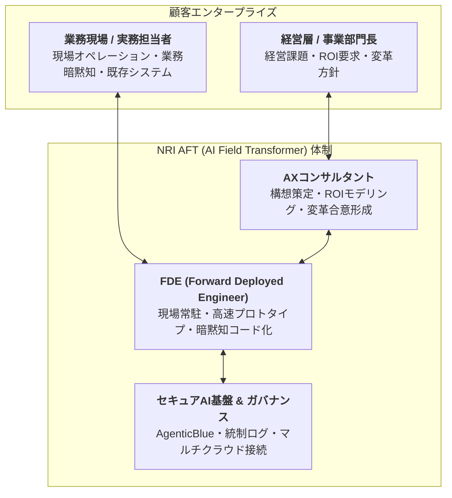
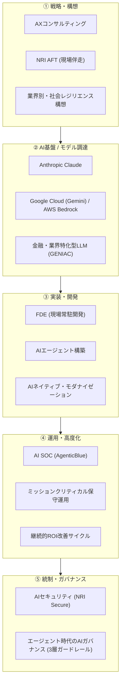

# AI Products / Services — 2026

基準日: 2026-09-15

## 1. NRI AFT（AI Field Transformer）

2026年8月3日提供開始。

特徴は、AX支援チームとFDEが顧客現場へ入り、構想策定から実装・運用まで一気通貫で支援する点。

### 主な要素

- 日本企業固有の業務知識・商習慣への理解
- 経営と現場をつなぐコンサルティング
- 現場常駐型のFDE
- 高速なROI検証
- 暗黙知の形式知化
- AIエージェントへの知識反映
- セキュアなAIプラットフォーム

### 分析

AFTはAI PoC支援のブランドではなく、AI時代向けのデリバリーモデル再設計として見る方が重要。

---

## 2. Anthropic / Claude導入支援

2026年2月にパートナーシップを拡大。

提供対象はLLM利用だけでなく、

- Claude
- Claude Code
- Claude for Enterprise
- Claude Cowork検証
- コンサルティング
- 導入 / 実装
- 運用支援

まで広がる。

NRI自身もClaude for Enterpriseを導入し、自社利用で得たノウハウを顧客支援へ還流するモデル。

---

## 3. AI共創モデル

2025年からAWS・Google Cloud等との共創モデルを強化。

### AWS

生成AI分野で戦略的協業し、AI導入支援、特化型AIエージェント、業界・タスク特化LLM、AIセキュリティ等を展開。

### Google Cloud

Vertex AI / Gemini Enterprise等を使い、業種・業務別AIエージェントを開発する体制を整備。

### 分析

特定クラウドへロックインするより、「顧客要件に応じて複数クラウド / モデルを組み合わせるSIer」としての立場を維持しようとしている。

---

## 4. 業界・タスク特化型LLM

2026年3月、GENIAC第3期の成果として、金融業務に特化したLLM構築手法を発表。

特定の金融実務タスクではGPT-5.2を上回る精度を確認したとしている。

### 重要な点

これは「NRIが巨大基盤モデル競争へ参入する」という意味ではない。

むしろ、

> 汎用LLM + 顧客 / 業界特化モデル + エージェント

という構成で、専門業務の精度を上げる戦略。

---

## 5. 社会レジリエンスAI

2026年5月、東京大学田中研究室の知見を基に構想を発表。

熟練者の知見・業務データを入力として、AIエージェントが

- 変化検知
- 要因分析
- 対策提案

を自律的に行い、継続的に精度を高める。

### 分析

NRIのAI戦略に一貫しているのは「暗黙知の形式知化」。

AFTでも社会レジリエンスAIでも、人間の経験知をAIへ移植することが重要テーマになっている。

---

## 6. AgenticBlue / AI SOC

2026年8月6日、NRI SecureがNeoSOCに独自AI統制基盤「AgenticBlue」を導入。

AIが、

- アラートトリアージ
- 一次調査
- 分析
- 脅威重要度判定
- 報告作成

まで自動化する。

AgenticBlueは、

- アクセス制御
- 認証情報管理
- 機密データ保護
- AI判断過程の記録 / 可視化
- 複数AIによる相互検証

を備える。

### 分析

これは「AIセキュリティをコンサルする」だけでなく、NRI自身の運用サービスをAIネイティブ化する実例。

---

## 7. AIガバナンス支援

2026年8月27日、NRI SecureはAI等のエマージングテクノロジーを対象に、セキュリティガバナンス構築支援を開始。

AIエージェント普及により、従来の情報セキュリティ統制だけでは足りなくなることを前提にしている。

9月には「エージェント時代のAIガバナンス」をテーマに、経営・プロセス・技術の3層ガードレールを打ち出している。

---

## 8. サービス群を構造化すると

## 評価

NRIのAIサービス群は点在して見えるが、2026年になるとかなり一本のストーリーになってきた。

**「構想 → 実装 → エージェント化 → 運用 → 統制」まで全部取る**ことが狙い。

今後の課題は、これらが個別サービスの寄せ集めではなく、案件として本当に横断的に連携できるか。

## Sources

- https://www.nri.com/jp/news/newsrelease/20260803_1.html
- https://www.nri.com/jp/news/info/20260224_1.html
- https://www.nri.com/jp/news/newsrelease/20260327_1.html
- https://www.nri.com/jp/news/newsrelease/20260514_1.html
- https://www.nri.com/jp/news/info/20260806_1.html
- https://www.nri.com/jp/news/newsrelease/20260827_1.html
- https://www.nri.com/jp/news/event/2026_ai_governance.html
