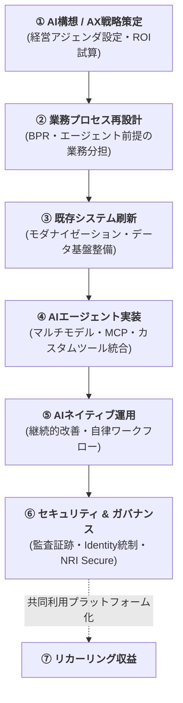
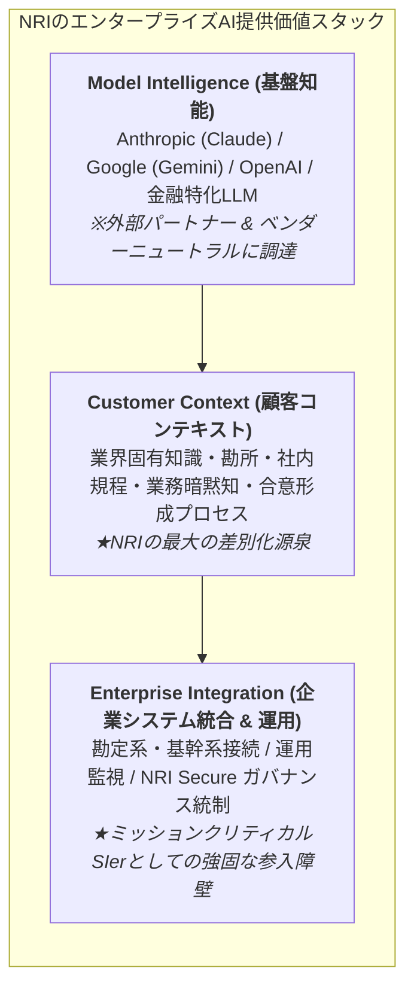
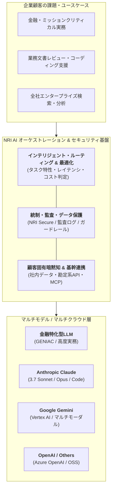
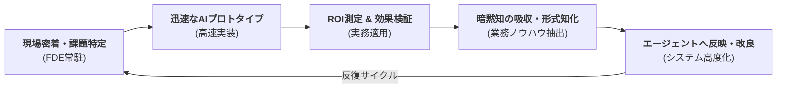

# NRIのAI / AX戦略 — 2026

基準日: 2026-09-25

## Executive take

2026年のNRIのAI戦略は、単純な「生成AI導入支援」ではない。

NRIが狙っているのは、

> 基盤モデルを作る会社

ではなく、

> **強力な基盤モデルを企業の現実の業務・システム・組織へ埋め込み、企業変革まで実装する会社**

というポジションである。

AIの技術進化が速いほど、単一モデルに賭けるより、複数のモデル・クラウド・業界特化モデルを評価して組み合わせる能力の価値が上がる、というのがNRIの基本ロジックに見える。

---

## 1. 生成AIからAXへ

2026-2028中期経営計画では、「AIによるビジネス変革」が成長領域として明示された。

5月の中計フォローアップでは、企業のAX動向とNRIの戦略が独立テーマになり、2028年度にAI関連売上3,000億円以上を目指す。

### Interpretation

NRIはAIを単なるツール販売・導入支援ではなく、次の需要連鎖を作る入口としている。

この流れでは、AIモデルの利用料だけでなく、コンサルティング・システム刷新・運用までNRIの売上機会になる。

---

## 2. NRIが自社の強みとしているもの

NRIの2026年の公式発信で繰り返されるのは以下。

- 経営・事業コンサルティング
- 業界知識
- 顧客業務への深い理解
- 長期顧客関係
- 既存システムへの知識
- 大規模システム実装力
- セキュリティ
- 運用
- 日本企業特有の商習慣・合意形成・暗黙知への理解

### Interpretation

フロンティアモデルの性能そのものはOpenAI、Anthropic、Google等が握る。

NRIの競争優位は、

**Model Intelligence × Customer Context × Enterprise Integration**

のうち、後ろ2つを深く握ることにある。

モデル性能差が縮小・高速に入れ替わるほど、「最適モデルを選び、企業固有の制約下で動かす能力」の重要性はむしろ高まる。

---

## 3. Anthropicとの関係は深い。ただしClaude一本足ではない

2026年2月24日、NRIはAnthropic Japanとのパートナーシップ拡大を発表した。

主な内容は、

- Claudeの日本企業向け導入支援
- Claude Codeの導入・実装支援
- Claude for EnterpriseのNRI社内導入
- AWS経由での利用拡大
- Claude Coworkの実践検証
- 技術者育成

である。

またAnthropic側のNRI事例では、Claudeを用いた日本語の複雑な業務文書レビューでレビュー時間を50%削減したとされる。

### Interpretation

AnthropicはNRIにとって2026年時点で非常に重要なAIパートナーである。

理由は、

- エンタープライズ志向
- セキュリティ / Safety志向
- AWS Bedrockとの親和性
- Claude Code等による開発工程への入り込み

が、NRIの顧客層・事業モデルと噛み合うため。

ただしNRIは「Claudeが常に最良」とはしていない。

業務タスクに即した独自ベンチマークで複数モデルを比較する考え方を持ち、Google Cloud / Gemini、AWS、業界特化LLMも並行している。

---

## 4. マルチモデル戦略

NRI AIの公式ページでは、外部パートナーとの共創を明示している。

2025年から、

- AWSとの生成AI戦略協業
- Google CloudへのAI共創モデル拡大
- Anthropicとの協業拡大

を進めている。

さらに2026年3月には、GENIACで金融業務に特化したLLM構築手法を開発し、特定業務ではGPT-5.2を上回る精度を確認したとしている。

### Interpretation

NRIの思想は、

> 最強の汎用モデルをそのまま使えばよい

ではない。

むしろ、

- タスク
- セキュリティ
- コスト
- データ所在
- 規制
- 日本語特性
- 既存システム

に応じてモデルを選択・組み合わせる。

この点は、2026年後半のモデル更新速度がさらに上がったことで合理性が増している。

---

## 5. AFTはAI時代のSIモデル再設計

2026年8月3日に開始したNRI AFT（AI Field Transformer）は、今年のAI戦略の中でも特に重要。

NRI AFTは、FDE（Forward Deployed Engineer）が顧客現場に入り、

- 課題特定
- AX構想
- AI実装
- ROI検証
- 暗黙知の形式知化
- AIエージェントへの反映
- 運用・定着

まで伴走する。

### Interpretation

従来型SIでは、要件定義後に大きなシステムを作る。

AFTは、

という高速ループ型。

これはPalantirのForward Deployed Engineer型モデルに近い部分がある。

NRIにとっては、AIによって開発速度が上がり「人月」が価値になりにくくなる中で、顧客成果・業務変革・継続運用へ課金軸を移す布石とも読める。

---

## 6. AIエージェントが中心テーマへ

2026年のNRI発信では、単発のチャット利用よりAIエージェントが中心になっている。

具体例:

- Claude Cowork検証
- Claude Code
- 業界・タスク特化LLM + AIエージェント
- 社会レジリエンスAI
- NRI AFT
- SOCのAgenticBlue
- AIエージェント時代のガバナンス

### Interpretation

NRIが見ているAIの次段階は、

> 人間が質問してAIが答える

から

> **AIが業務プロセスの一部を自律実行する**

への移行。

この変化はNRIのビジネスにとって両刃である。

### Opportunity

- 顧客の複雑な業務をAI化する大型案件
- 既存システム刷新
- セキュリティ / 運用需要
- データ・ナレッジ基盤

### Threat

- コーディング工数の急減
- 既存SaaSや業務システムの一部代替
- AIベンダーの直接エンタープライズ進出
- SIの人月単価モデルへの圧力

---

## 7. NRIのAI戦略の競争上の強み

### Strength 1 — 顧客コンテキスト

金融・産業・公共などの業務と既存システムを長年理解している。

### Strength 2 — 上流と実装が同じ会社にある

戦略コンサルだけでも、システム開発だけでもない。

### Strength 3 — 高い信頼性が必要な業界

金融や大企業では「最も賢いモデル」だけで導入が決まらない。

### Strength 4 — セキュリティ事業を内部保有

NRI Secureを持つことはAgentic AI時代にかなり大きな差別化要素になり得る。

---

## 8. 最大の戦略リスク

### Risk 1 — AI企業が統合領域まで侵食

OpenAI / Anthropic / Google等が、モデルだけでなくエージェント、コネクタ、業務ワークフロー、コンサル支援まで広げればNRIとの境界は狭くなる。

### Risk 2 — 生産性向上が売上減少になる

開発工数が40%減るなら、同じ人月単価モデルでは売上も減る。

NRIはアウトカム型・共同利用型・高付加価値上流へ移る必要がある。

### Risk 3 — モデル更新速度

モデル更新が月単位、週単位になれば、社内審査・標準化・導入プロセスが追いつかない可能性がある。

### Risk 4 — ガバナンス過多

安全性を重視しすぎて現場導入が遅れれば、スピード重視の競合に負ける。

---

## 9. 現時点での評価

**方向性はかなり合理的。実行難易度は非常に高い。**

NRIはモデル開発競争を正面から戦わず、

- 顧客コンテキスト
- 業界特化
- システム統合
- セキュリティ
- 運用
- FDE型実装

を競争軸に置いた。

これはNRIの既存資産との整合性が高い。

ただし、AIによる生産性上昇を「工数削減」だけで終わらせず、**より高い価値と売上へ変換できるか**が2026〜2028年の最大の経営課題になる。

## Sources

- https://ai.nri.com/
- https://www.nri.com/jp/news/info/20260224_1.html
- https://www.nri.com/jp/news/newsrelease/20260327_1.html
- https://www.nri.com/jp/news/newsrelease/20260803_1.html
- https://claude.com/customers/nri
- NRI 中期経営計画（2026-2028） / フォローアップ資料
