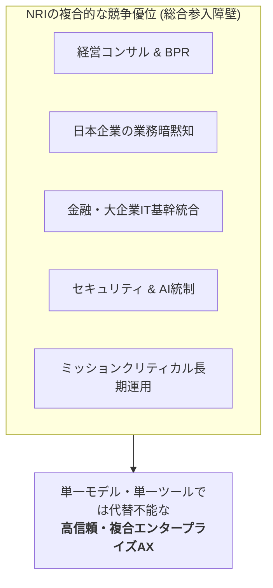

# Competitor Map — 2026 AI / AX競争環境

基準日: 2026-09-15

## Executive take

NRIの競争相手は1種類ではない。

- Accenture / Deloitte：経営変革・業務再設計・FDE
- NTT DATA：国内大企業・金融・公共 + グローバルITサービス
- IBM：AIエージェント運用・ガバナンスの基盤レイヤー
- Fujitsu / Hitachi：国内大企業基盤 + 自社技術 + Physical AI

NRIが最も競争優位を持ちやすいのは、**日本の金融・大企業で、既存システムと業務知識を深く理解し、AI構想から長期運用まで一体で支援する案件**。

逆に相対的に弱いのは、**グローバルFDEの量、汎用AIプラットフォーム製品、Physical AI、自社モデル/研究開発規模、AI企業への投資・買収速度**である。

---

## 2026 ポジショニングマップ

```mermaid
quadrantChart
    title 2026 AI / AX 競争ポジショニングマップ
    x-axis 低 (国内集中 / SI主導) --> 高 (グローバル規模 / プラットフォーム製品力)
    y-axis 低 (汎用ツール導入) --> 高 (日本企業の業務・基幹・長期運用深度)
    quadrant-1 グローバル基盤・プラットフォーム覇権
    quadrant-2 高信頼・複合統合型AX (NRIの主戦場)
    quadrant-3 個別PoC・局所導入
    quadrant-4 グローバルスケール・大規模変革
    NRI: [0.35, 0.92]
    NTT DATA: [0.65, 0.82]
    Accenture: [0.88, 0.65]
    IBM: [0.80, 0.48]
    Deloitte: [0.70, 0.58]
    Fujitsu: [0.52, 0.70]
    Hitachi: [0.60, 0.76]
```

## 横並び比較

| 企業 | 2026年AIの中心テーマ | 強いレイヤー | NRIとの競合度 | NRIから見た最大の脅威 |
|---|---|---|---|---|
| NRI | AX / AFT / FDE / AI駆動開発 / Governance | 日本企業の業務・IT・運用統合 | — | — |
| Accenture | Agentic reinvention / AI Refinery / FDE | グローバル変革・実装・アライアンス | 非常に高い | 1,000人FDE、Google/OpenAI/ServiceNow等との同時連携 |
| NTT DATA | Smart AI Agent / AI-native enterprise | グローバルIT、金融・公共、インフラ | 高い | NRIに近い顧客基盤 + 世界規模のデリバリー |
| IBM | Agentic Control Plane / watsonx | AI運用基盤、Hybrid Cloud、Governance | 中〜高 | エージェント運用・統制を標準製品化 |
| Deloitte | Agentic BPR / Open Model Engineering | 経営・業務変革、Risk、業界コンサル | 高い | AXの上流とガバナンス領域を奪う |
| Fujitsu | Kozuchi / Takane / Multi AI Agent | 自社AI技術、計算基盤、国内SI、現場AI | 高い | 独自技術と既存顧客基盤の一体化 |
| Hitachi | Lumada 3.0 / HMAX / Physical AI | IT×OT×Product、社会インフラ | 中〜高 | Physical AIとAnthropicを大規模に統合 |

---

## 競争軸別の相対ポジション

記号は公開情報から見た相対評価。絶対評価ではない。

| 競争軸 | NRI | Accenture | NTT DATA | IBM | Deloitte | Fujitsu | Hitachi |
|---|---|---|---|---|---|---|---|
| 日本企業の業務知識 | ◎ | ○ | ◎ | △ | ○ | ◎ | ◎ |
| 金融ミッションクリティカル | ◎ | ○ | ◎ | ○ | △ | ○ | ○ |
| 経営コンサル / BPR | ◎ | ◎ | ○ | ○ | ◎ | ○ | ○ |
| FDE型AI実装 | ○→強化中 | ◎ | ○ | △ | ○→強化中 | ○ | ○ |
| グローバルデリバリー規模 | △ | ◎ | ◎ | ◎ | ◎ | ○ | ○ |
| AI Agent基盤製品 | △ | ○ | ○ | ◎ | △ | ○ | ○ |
| モデル / AI研究開発 | △ | △ | △ | ◎ | △ | ◎ | ○ |
| Physical AI / OT | △ | ○ | ○ | △ | △ | ○ | ◎ |
| セキュリティ / AI Governance | ◎ | ○ | ○ | ◎ | ◎ | ○ | ○ |
| 長期運用 / Managed Service | ◎ | ◎ | ◎ | ◎ | ○ | ◎ | ◎ |
| Vendor neutrality | ◎ | ○ | ○ | ◎ | ◎ | △〜○ | △〜○ |

### 読み方

NRIは「すべての軸で世界トップ」ではない。

むしろ、

> コンサル × 日本企業の暗黙知 × 金融/大企業IT × セキュリティ × 長期運用

という複数要素の組み合わせが強い。



AI時代には個々の技術差が短期間で縮まりやすいため、この**複合的な顧客コンテキスト**が重要な競争資産になる。

---

## 2026年に競争が激化したポイント

### FDEが一般化した

FDEはPalantir等の特徴的なデリバリーモデルだったが、2026年にはAccenture、Google Cloud、ServiceNow、Deloitte、NRIなどが類似概念を明示的に使うようになった。

つまりNRI AFTのFDEは重要だが、**FDEという言葉自体は差別化にならない**。

差がつくのは、

- FDEが理解している業務
- アクセスできる顧客固有データ
- 既存システムとの接続力
- ROIを出すまでの速度
- 本番後の運用責任

である。

### Agentic AIがPoCから運用へ移行

IBMは「作ること」より「運用・監視・統制」を重視し、NTT DATAは業界別エージェントを実サービス化、DeloitteはBPRそのものをAgentic AI前提に再設計している。

NRIもAFTやAgenticBlueによって同じ方向へ移っている。

### モデル選定よりオーケストレーションが価値になる

Claude / Gemini / OpenAI / Open Model等の性能差が短期間で変化するため、企業側の価値は

- どのモデルを選ぶか
- 複数モデルをどう併用するか
- データをどう安全に渡すか
- どのエージェントに何を許可するか
- 失敗時に誰が止めるか

へ移っている。

NRIがマルチモデル戦略を採ること自体は合理的だが、IBM等がこの統合層を製品として標準化すると、NRIはより上流・業務固有領域へ価値を移す必要がある。

---

## 競合を3タイプに分類

### Type A — Transformation Giants

**Accenture / Deloitte**

経営層から入り、業務そのものをAI前提で再設計する。

NRI AFTと最も直接的に重なる。

### Type B — Technology / Platform Giants

**IBM / Fujitsu / Hitachi**

AI基盤・自社技術・データ・インフラ・OT等まで持ち、プラットフォームを軸に囲い込む。

NRIはこれらの製品を使う側にも競争する側にもなる。

### Type C — Global SI / Managed Services

**NTT DATA**

業界知識、システム構築、運用、グローバルデリバリーを一体提供。

会社の成り立ちは異なるが、顧客から見るとNRIに最も似た選択肢になりやすい。

---

## NRIにとっての重要な意味

AI時代には、「AIを扱える会社」であることは早期にコモディティ化する。

NRIが差別化するには、

1. AFTを名前だけでなく実案件・ROIで証明する
2. 金融・製造・流通等で再利用可能な業界AI資産を蓄積する
3. AI駆動開発で内部原価を下げる
4. AgenticBlue等を横展開しAI運用・統制まで握る
5. モデルベンダーに依存しない統合能力を維持する
6. 顧客の暗黙知・データ・既存ITを「AIが使える形」へ変換する能力を資産化する

必要がある。

## Sources

詳細は [`../sources/competitor-sources.md`](../sources/competitor-sources.md)。
